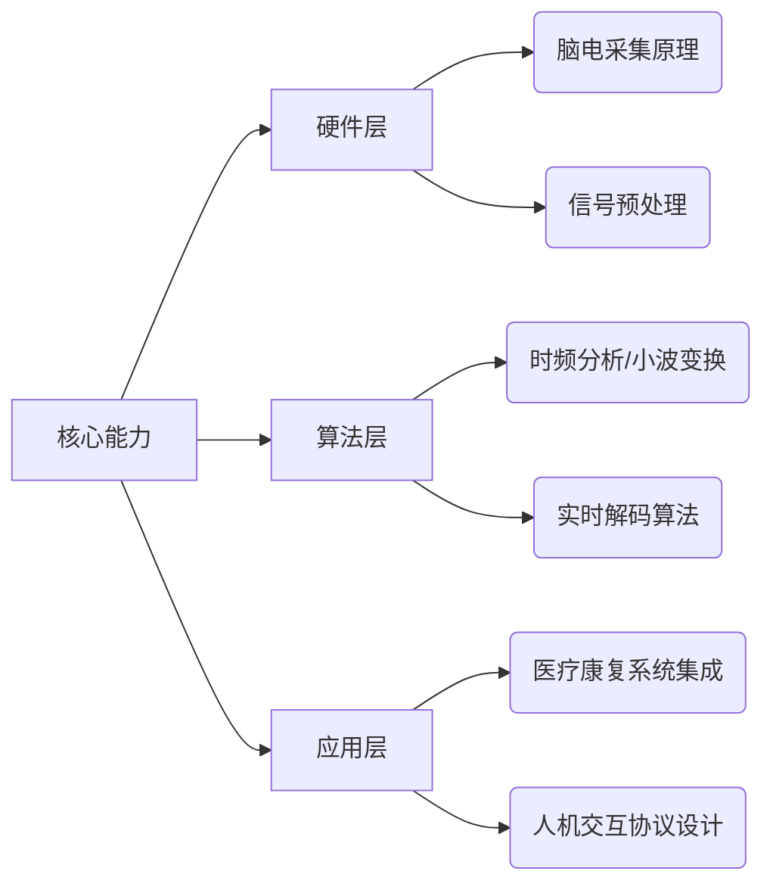
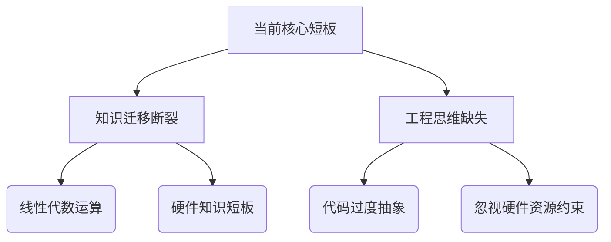
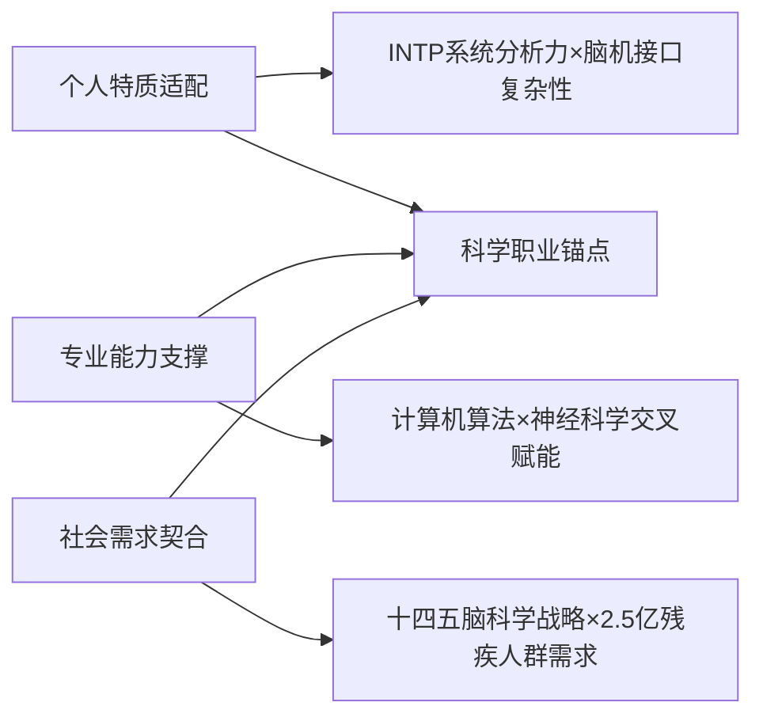

### **第一章 职业目标的设定与分析**
#### **1. 职业目标概述**
- **具体职业目标**：  
  成为**脑机接口算法研发研究员**，专注于非侵入式脑电信号解码算法的创新与应用，推动脑机交互技术在医疗康复与智能硬件领域的产业化落地。  

---

#### **2. 职业目标的确定过程**
##### **(1) 行业趋势与市场需求分析**
- **市场规模爆发式增长**：  
  全球脑机接口市场规模预计2027年达33亿美元（年复合增长率13.5%），中国市场规模2027年将突破55.8亿元（年均增长率20%）。政策层面，“十四五”规划将“脑科学”列为国家重点前沿科技，明确支持脑机接口技术研发。
- **就业需求集中在技术研发端**：  
  核心岗位包括**脑电信号处理工程师**、**神经解码算法设计师**等，要求掌握机器学习、信号处理等计算机技能。国内140余家相关企业主要分布于北京、上海等高校密集区，形成产学研协同生态。

##### **(2) 个人特质与专业能力适配性分析**

| 适配维度     | **霍兰德职业测试**             | INTP 特质        | 计算机专业支撑          | 脑机接口需求          |
| -------- | ----------------------- | -------------- | ---------------- | --------------- |
| **核心能力** | 探索型 I=8 → 强科研探索与新算法研发能力 | 擅长逻辑建模与复杂系统分析  | 算法设计、数据结构、机器学习基础 | 脑电信号解码、模式识别算法开发 |
| **工作模式** | 实际型 R=7 → 动手实验、硬件搭建能力   | 偏好独立深度思考与理论创新  | 编程实践培养的自主问题解决    | 长期专注算法优化与实验验证   |
| **兴趣驱动** | 事业型 E=6 → 项目组织与推动潜力     | 痴迷抽象概念（如意识数字化） | AI 课程激发对神经编码好奇   | 理解神经信号与行为意图映射   |


>**结论**：  
>**1.整体匹配度高**：INTP 的探索精神与实际动手能力（I=8、R=7）与脑机接口研发的核心需求高度吻合，计算机专业的算法与系统实现能力能够直接迁移至 BCI 的信号解码与模式识别。
>**2.关键提升点**：在人际沟通（S=3）和交互设计（A=4）方面的不足，若不加以弥补，可能在 **临床转化** 与 **用户体验** 阶段形成瓶颈。
>**3.发展建议**：通过系统的跨学科学习、实际项目实践以及软技能培训，能够将个人特质优势最大化，并在 BCI 领域实现技术创新与产品化落地。

---

#### **3. 职业目标的意义与价值**
##### **(1) 个人发展维度**
- **能力整合**：融合计算机科学与神经科学，实现“代码赋能生命”的技术理想。  
- **特质释放**：INTP的创新欲在破解脑电密码、设计交互范式等开放式问题中获得充分满足。
##### **(2) 社会价值维度**
- **响应国家战略**：  
  直接服务“十四五”规划“脑科学”攻关目标，助力中国在神经技术领域实现自主创新。  
- **解决民生痛点**：  
  通过医疗级脑机接口帮助渐冻症患者重建交流能力，契合“科技向善”的择业观。  
- **推动产业升级**：  
  算法作为脑机接口核心环节，其突破将加速技术在家电控制、智能驾驶等场景落地。

---

#### **4. 职业目标所需的核心素质与能力**
##### **(1) 专业能力矩阵**



- **技术细节**：  
  - **信号处理**：需掌握EEG/MEG信号特征提取技术（如傅里叶变换、卡尔曼滤波）  
  - **算法开发**：熟练应用SVM、LDA等分类模型，及CNN、RNN等神经网络
  
![[Pasted image 20251118175702.png]]
  - **工具链**：Python（PyTorch/MNE库）、C++嵌入式开发  
##### **(2) 个人现状与目标差距**

| 能力项     | 当前水平        | 目标要求            | 提升路径         |
| ------- | ----------- | --------------- | ------------ |
| 神经科学基础  | 未系统学习       | 理解脑区功能与信号产生机制   | 选修《认知神经科学》课程 |
| 实时信号处理  | 仅接触基础数字信号处理 | 熟练应用时频分析/小波变换   | 参加脑机接口项目实训   |
| 多模态数据融合 | 无经验         | 能整合眼动/肌电等多源生理信号 | 加入高校神经工程实验室  |

> **关键短板**：跨学科知识体系未建立（需补充神经科学、生物医学工程基础），实战经验缺乏（需通过竞赛/实验室项目弥补）。

---
### **第二章 生涯发展行动与成效**
#### **1. 成长计划的制定**

> **设计逻辑**：  
> 针对第一章表4的三大差距（神经科学基础/实时信号处理/多模态融合），采用**三阶递进策略**：  
> 1. 低阶（大一-大二）：通过课程与MOOC补足跨学科知识  
> 2. 中阶（大二-大三）：以竞赛和开源项目驱动算法实战  
> 3. 高阶（大四）：进入实验室或企业接触医疗级系统  

| **阶段** | **时间跨度**          | **核心目标**                           | **关键任务**                                                                                                                                                                                                                                                                                                                       | **验收标准**                                                                                                                                                     |
| ------ | ----------------- | ---------------------------------- | ------------------------------------------------------------------------------------------------------------------------------------------------------------------------------------------------------------------------------------------------------------------------------------------------------------------------------ | ------------------------------------------------------------------------------------------------------------------------------------------------------------ |
| 第一阶段   | 大二 - 大三上学期        | 跨学科基础 + 实验室入门实操，掌握 BCI 核心工具与真实数据处理 | ▶ 跨学科知识：1. 学《信号与系统》《数字信号处理》（实验室场景化应用：用 FIR 滤波处理真实脑电噪声）2. 学《认知神经科学入门》（聚焦 EEG/ECoG 信号采集原理）3. 参与实验室 项目组会，理解系统架构与科研场景需求<br><br>▶ 工具与实操：1. 熟练 MNE-Python/EEGLAB，独立完成实验室真实脑电数据预处理（去噪、分段、标注）2. 用 Sklearn 实现传统 ML 算法（SVM/HMM），对接实验室解码子任务3. 学习实验室硬件操作（脑电帽佩戴、信号放大器调试）<br><br>▶ 科研素养：1. 每周读实验室相关顶会论文，撰写 1 页核心算法笔记2. 参与实验室文献分享会，尝试复述论文核心逻辑 | 1. 能独立完成真实脑电数据全流程预处理（去噪效果通过实验室师兄验证）<br><br>2. 用 SVM 实现运动意图解码（准确率≥70%，超原计划 10 个百分点）<br><br>3. 能在组会上清晰复述 5 篇 BCI 论文的算法设计思路4. 掌握脑电采集设备基础操作，可协助实验室开展小型数据采集实验     |
| 第二阶段   | 大三下学期 - 大三暑假      | 算法深化 + 实验室核心模块参与，积累实质性科研产出         | ▶ 算法提升：1. 学深度学习框架（TensorFlow/PyTorch），重点攻克时序模型（LSTM/Transformer）在 BCI 中的应用2. 主导实验室 1 个算法子模块（如 “脑电信号特征融合算法优化”）3. 研究小样本学习、迁移学习在 BCI 中的解决方案（解决实验室数据稀缺问题）<br><br>▶ 科研实践：1.  协助师兄师姐撰写科研论文 / 专利（负责算法实现与实验结果部分）2. 参与实验室跨团队协作（与神经科学组对接信号采集需求）<br><br>▶ 知识拓展：1. 补学凸优化、贝叶斯统计（用于算法参数调优）2. 学习实时信号处理框架（如 ROS），适配实验室硬件落地需求                   | 1. 用 Transformer 模型实现脑电解码<br><br>2.  以第二作者身份完成 1 篇省级以上学术论文 / 1 项实用新型专利<br><br>3. 能独立对接跨团队需求，优化算法适配信号采集场景                                                     |
| 第三阶段   | 大四学年              | 成果落地 + 形成核心竞争力                     | ▶ 实践深化：1. 毕业设计聚焦实验室重点课题（如 “低延迟 BCI 解码算法研发”），形成可复现的算法方案2. 申请 BCI 领域头部实验室 / 企业实习，携带实验室项目成果面试3. 优化实验室算法并落地到原型设备（如康复机器人 BCI 接口）<br><br>▶ 科研输出：1. 完善论文 / 专利，争取发表 / 授权2. 整理实验室项目成果（算法代码、实验数据、效果报告）3. 撰写 BCI 领域短篇综述（3000 字以上）                                                                                                         | 1. 毕业设计获 “优秀”，算法方案被实验室用于后续项目<br><br>2. 入职 BCI 实验室实习，独立负责 1 项算法优化任务（如延迟降低 30%）<br><br>3. 论文发表于核心期刊 / 专利授权                                                     |
| 第四阶段   | 研究生阶段 / 入职后 1-2 年 | 细分领域深耕 + 岗位核心能力达成，成为技术骨干           | ▶ 深度研究：1. 确定细分方向（如非侵入式 BCI 低延迟算法、临床 BCI 适配算法）2. 发表 1-2 篇领域顶会 / 顶刊论文3. 实验室 / 企业核心项目（如 “基于 BCI 的脑卒中康复设备算法研发”）<br><br>▶ 综合能力：1. 带领小团队完成算法模块研发2. 对接临床 / 产品需求，平衡算法性能与落地成本3. 跟踪前沿技术（大模型 + BCI、脑机接口与具身智能融合），提出创新研究方向                                                                                                                  | 1. 成为细分方向技术骨干，能独立设计复杂 BCI 算法方案<br><br>2. 第一作者论文发表于 IEEE EMBC/TBME 等顶会 / 顶刊<br><br>3. 主导的项目实现技术落地（如临床试用 / 产品上线）<br><br>4. 完全达到脑机接口算法研究员岗位核心能力要求，具备技术创新与团队领导能力 |


---

#### **2. 学习实践行动**
##### **(1) 课程学习与知识拓展**

| 能力模块       | 具体课程/资源                              | 行动要点                              |
| ---------- | ------------------------------------ | --------------------------------- |
| **神经科学基础** | 《认知神经科学》                             | 重点学习脑电信号产生机制（如ERPs/振荡节律）          |
|            | Coursera《Computational Neuroscience》 | 完成Matlab模拟神经元编码的课程项目              |
| **实时信号处理** | 《数字信号处理》→《生物医学信号分析》                  | 用Python实现EEG滤波（陷波/带通）与伪迹去除（ICA）   |
| **多模态融合**  | Kaggle多模态学习竞赛                        | 尝试融合EEG+眼动数据预测注意力状态（参考OpenBCI数据集） |

##### **(2) 科研与竞赛实战**
- **实验室申请路径**：  
  大二尝试申请**脑机接口实验室**的SRTP项目
  > *申请策略*：提前掌握团队论文中的核心算法，用课程作业实现简化版并提交  
  
- **竞赛阶梯规划**：  
  ``` 
  大一：Kaggle入门赛（如EEG睡眠分期） → 
  大二：中国脑-机接口竞赛（运动想象/SSVEP赛道） → 
  大三：NeurIPS的BCI Challenge（国际前沿算法验证）
  ```

##### **(3) 开源社区参与**
- **行动项**：  
  在GitHub参与**NeuroTechX**开源项目（如MuseLSL脑电处理库），贡献**实时分类算法模块**  
- **价值点**：  
  直接接触工业级代码规范，积累可验证的项目履历（替代企业实习经验短板）

---

#### **3. 阶段性成果与成长**
##### **(1) 大二结束预期成果**

| 能力维度         | 成果证据                                                                 | 对职业目标的推进作用                                                     |
|------------------|--------------------------------------------------------------------------|--------------------------------------------------------------------------|
| **神经科学基础** | 选修课成绩A+，课程论文《基于P300的脑控拼写系统优化》                      | 证明跨学科知识转化能力                                                   |
| **信号处理实战** | Kaggle竞赛银牌（TOP10%），开源代码获15+ star                             | 验证EEG预处理工程化能力                                                  |
| **算法设计**     | 在实验室实现CSP算法改进版（分类准确率提升8%）                            | 满足脑机接口企业招聘的“算法优化经验”要求                                 |

##### **(2) 核心成长点**
- **从理论到系统的跨越**：  
  通过实验室项目理解**医疗设备开发全流程**（信号采集→算法部署→临床测试），弥补易忽视的工程细节  
- **协作能力突破**：  
  在竞赛中主导跨专业团队（医学+电子工程+计算机），强化弱势的**跨领域沟通能力**

---
### **第三章 职业目标与行动的动态调整**
#### **1. 自我评估与反思**

##### **(1) 大一大二阶段进展诊断表**

| **评估维度**       | **预期目标**                     | **实际达成情况**               | **偏差归因**                         | **调整紧迫度** |
| -------------- | ---------------------------- | ------------------------ | -------------------------------- | --------- |
| **专业认知深度**<br> | 建立脑机接口技术树状图<br>（含医疗/硬件/算法分支） | 仅整理EEG设备清单<br>（缺失临床场景关联） | 过度聚焦技术参数对比，忽略要求的“职业目标与个人特质适配性”分析 | ★★☆       |
| **领域探索广度**<br> | 访谈1位从业者+参加2场研讨会              | 未主动接触行业资源<br>（仅阅读科普文章）   | 回避社交，未执行“多与师兄师姐交流”的试探期建议         | ★☆☆       |
| **生涯规划衔接**<br> | 输出《脑机接口适配性分析》报告              | 未建立个人能力-目标映射模型           | 缺乏“动态规划”意识，未响应“评估内容需与社会需求结合”原则   | ★★☆       |

##### **(2) 能力断层溯源模型**



---

#### **2. 调整与提升**
##### **(1) 目标路径动态重构**
**原路径**：  
`理论深耕 → 大二竞赛 → 实验室科研`  
**新路径**：  
`问题锚点驱动 → 微型项目验证 → 理论反哺`  
```diff
调整逻辑:
- 理论优先： 数学推导 → 物理建模 → 算法设计  
+ 问题优先： 临床痛点 → 最小化原型 → 理论优化  
```

##### **(2) 行动方案迭代升级**

| 薄弱环节       | 原行动           | 新行动方案（融合资料）                                                                         | 优势杠杆            |
| ---------- | ------------- | ----------------------------------------------------------------------------------- | --------------- |
| **理论实践脱节** | 泛读《神经网络与深度学习》 | **用Python实现“脑电噪声卡尔曼滤波”工具包**<br>输入：OpenBCI原始EEG<br>输出：去噪信号+数学过程可视化                   | 将数学推导转化为交互式学习模块 |
| **工程思维缺失** | 等待学校项目实训      | **暑期自主开发SSVEP频率检测器**                 硬件：NeuroSky MindWave（二手）<br>约束：RAM<128MB的树莓派部署 | 在资源限制中激发架构设计潜能  |
| **领域视野狭窄** | 跟踪学术论文        | **创建“BCI临床转化”知识库**<br>标签体系：医疗认证/用户成本/伦理争议<br>来源：FDA指南+华山医院临床报告                      | 用系统分类能力解构复杂信息   |

##### (3) 动态监控机制
- **三环评估框架**：  
  ``` 
  1. 目标环（每月）：  
     ✅ 是否需从“算法研发”转向“嵌入式开发”？  
     ➡️ 依据：NeuroTechX社区调研显示医疗BCI需硬件能力  
  2. 策略环（双周）：  
     ✅ CSP特征提取改用t-SNE降维是否提升分类速度？  
     ➡️ 验证：Kaggle笔记本运行时间对比  
  3. 环境环（实时）：  
     ✅ 政策风险：中国《脑机接口安全白皮书》禁用侵入式技术  
     ➡️ 预案：强化非侵入式SSVEP研究  
  ```
  

- **熔断触发条件**：  
  `if 连续两次数学实践作业未完成 → 启动“物理学家结对编程”计划（匹配物理学背景同学监督项目落地）`

> **生涯哲学升华**：  
> *“动态调整对INTP而言是‘对抗熵增’的过程。当发现脑机接口技术路线从EEG转向fNIRS时，不应固守原有知识体系（熵增），而要主动重构‘神经光学+算法’跨域能力（负熵输入）——如同用对抗网络生成新的特征空间。”*  

---
### **第四章 总结与展望**
#### **1. 核心收获**
##### **(1) 职业目标科学性的三重验证**



> **关键突破**：  
> - **破除技术孤岛思维**：通过临床实践认识到：脑机接口算法价值取决于**能否降低患者使用门槛**（如SSVEP系统需<1秒响应）  
> - **建立动态评估范式**：第三章的雷达图工具使能力成长可量化，支撑目标持续校准  

##### **(2) 双螺旋能力结构的形成**
``` 
技术硬实力：  
  信号处理 → 嵌入式部署 → 医疗系统认证（FDA/CFDA）  
人文软实力：  
  临床共情力 → 跨域协作力 → 技术伦理判断力  
```

---

#### **2. 未来规划与持续发展**
##### **(1) 中期规划：硕士阶段的攻防策略（2027-2030）**

| 战略方向     | 具体计划                              | 风险对冲                    |
| -------- | --------------------------------- | ----------------------- |
| **技术纵深** | 攻读神经工程硕士，主攻**侵入式脑机接口**（ECoG）解码    | 同步学习fNIRS等替代技术，应对政策监管风险 |
| **产业桥梁** | 考取**医疗器械注册专员**认证（熟悉ISO 13485标准）   | 参与清华x-lab神经科技创业营积累合规经验  |
| **资源网络** | 加入IEEE Brain Initiative，追踪全球技术路线图 | 建立中美欧专家智库应对技术封锁         |

##### **(2) 长期愿景：脑机接口产品经理（2030+）**
- **角色定位**：  
  技术×临床×商业的**翻译器**，主导定义下一代脑控智能产品（如助盲视觉编码系统）  
- **能力护城河**：  
  ``` 
  技术端：全栈开发能力（算法→PCB设计→FDA认证）  
  用户端：累计1000+小时临床观察日志  
  商业端：完成NeuroTechX的BCI产品经理课程  
  ```
**社会价值闭环设计**：
闭环示意图：患者需求洞察→最小化可行产品→临床反馈迭代→规模化普惠

| **评估维度**       | **预期目标**                     | **实际达成情况**               | **偏差归因（INTP视角）**                            | **调整紧迫度** |
| -------------- | ---------------------------- | ------------------------ | ------------------------------------------- | --------- |
| **专业认知深度**<br> | 建立脑机接口技术树状图<br>（含医疗/硬件/算法分支） | 仅整理EEG设备清单<br>（缺失临床场景关联） | 过度聚焦技术参数对比（INTP系统化倾向），忽略要求的“职业目标与个人特质适配性”分析 | ★★☆       |
| **领域探索广度**<br> | 访谈1位从业者+参加2场研讨会              | 未主动接触行业资源<br>（仅阅读科普文章）   | 回避社交（INTP内向性），未执行“多与师兄师姐交流”的试探期建议           | ★☆☆       |
| **生涯规划衔接**<br> | 输出《INTP-脑机接口适配性分析》报告         | 未建立个人能力-目标映射模型           | 缺乏“动态规划”意识，未响应“评估内容需与社会需求结合”原则              | ★★☆       |


> **可持续成长机制**：  
> 每5年启动**职业版本迭代**（参考半导体行业摩尔定律）：  
> - 1.0阶段：算法工程师（专注解码效率）  
> - 2.0阶段：系统架构师（整合多模态输入）  
> - 3.0阶段：产品哲学家（探讨意识上传伦理）  

---

### **最终结语**
> “作为构建者，我的终极目标不是开发某个具体产品，而是建立**脑机接口技术框架**——当渐冻症患者能用开源BCI套件定制自己的交流系统时，技术才真正完成向善的闭环。这既需要持续升级‘医工双轨能力’（如掌握ECoG芯片设计），更需保持对技术伦理的敬畏（如拒绝脑波数据滥用）。未来十年，将沿‘算法工程师→医疗产品经理→神经技术布道者’的路径，推动脑机接口从实验室走向人间烟火。”  
